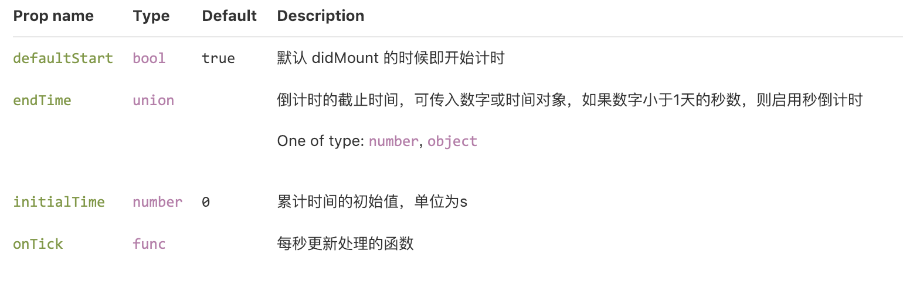
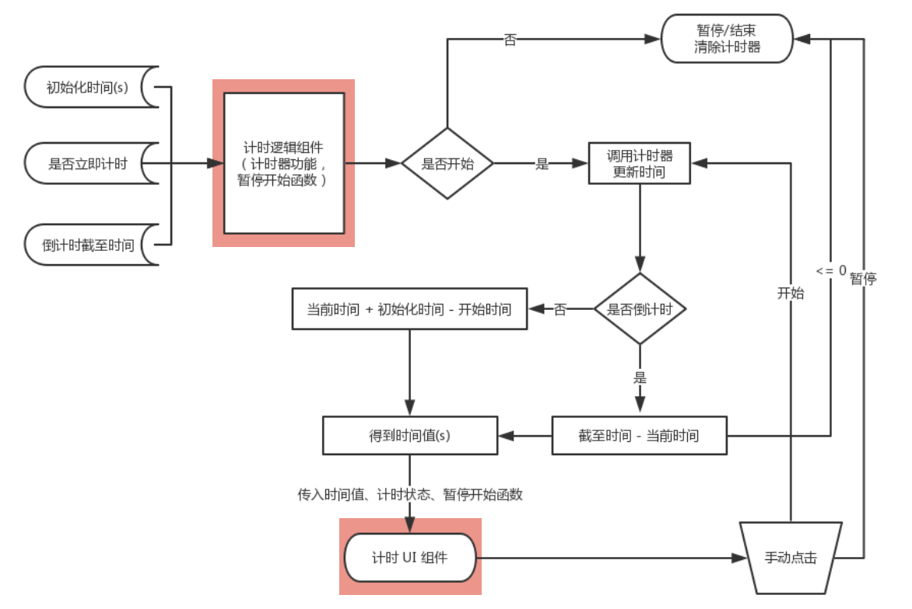

# React Timer Next

React timer next 为 react 的计时组件，提供顺计时（包含初始化时间），倒计时及开始暂停功能。[点此查看 demo](https://imweb.github.io/stone-ui/index.html#!/Timer)

## props



## 设计概要

该组件封装了一个计时功能，并且通过 `cloneElement` 方式向 `children` 自动传入了三个 props。

- time：计时秒数
- isPaused：计时状态
- changeStatus：切换状态函数

整体流程如下：



注意：该组件为**计时逻辑组件**不带任何 UI，只是封装了计时功能，**计时 UI 组件**请使用子元素自行完成设计样式。

## 常规使用

默认计时

```jsx
function Hello({time}) {
  return <div>计时： {time}</div>;
}
<Timer>
  <Hello />
</Timer>
```


初始计时时间

```jsx
function Hello({time}) {
  return <div>计时： {time}</div>;
}
<Timer initialTime={25}>
  <Hello />
</Timer>
```

带暂停功能计时

```jsx
function Hello({time, isPaused, changeStatus }) {
  return (
    <div>
      <p>计时：{time}</p>
      <Btn size="s" onClick={changeStatus}>{isPaused ? '开始' : '暂停'}</Btn>
    </div>
  );
}

<Timer initialTime={50}>
  <Hello />
</Timer>
```

初始暂停

```jsx
function Hello({time, isPaused, changeStatus }) {
  return (
    <div>
      <p>计时：{time}</p>
      <Btn size="s" onClick={changeStatus}>{isPaused ? '开始' : '暂停'}</Btn>
    </div>
  );
}

<Timer defaultStart initialTime={30}>
  <Hello />
</Timer>
```

## 倒计时

不到一天的秒数倒计时

```jsx
// endTime 设置为秒数
function Hello({time, isPaused, changeStatus }) {
  return (
    <div>
      <p>{time}s</p>
      <Btn size="s" onClick={changeStatus}>{'开始计时'}</Btn>
    </div>
  );
}

<Timer defaultStart={false} endTime={8}>
  <Hello />
</Timer>
```

距离某天倒计时

```jsx
// endTime 传入时间戳或距离1970年1月1日起的毫秒数
function Hello({time, isPaused, changeStatus }) {
  
  return (
    <div>
      <p>{formatTime(time)}</p>
    </div>
  );
}

function formatTime(time) {
  const oneDaySeconds = 24 * 3600;
  const timeNum = parseInt(time / 1000, 10);
  const days = Math.floor(timeNum / oneDaySeconds);
  const hours = Math.floor((timeNum - days * oneDaySeconds) / 3600);
  const minutes = Math.floor((timeNum - days * oneDaySeconds - hours * 3600) / 60);
  let seconds = timeNum - days * oneDaySeconds - hours * 3600 - minutes * 60;

  return `${days}天${hours}时${minutes}分${seconds}秒`;
}

// 注意月份是从0开始
const now = new Date();
<Timer endTime={new Date(now.getFullYear(), now.getMonth(), now.getDate() + 2)}>
  <Hello />
</Timer>
```